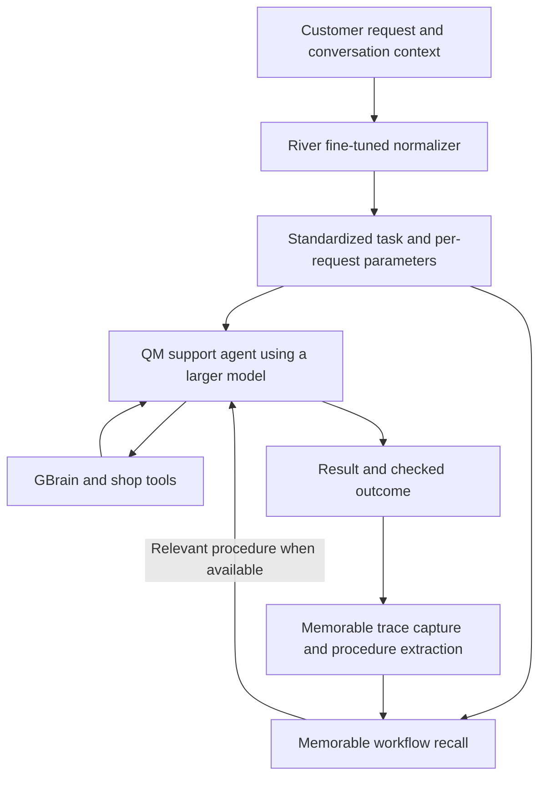

# Agreed design: a support agent that reuses its work

Agreed on September 27, 2026. This document records the product and architecture we converged on. Integration behavior, training quality, and cost savings still need to be demonstrated.

## Product and target customer

Agent histories contain work that gets repeated: retrieving records, looking up policies, transforming results, and following the same sequence of tools. Our feature discovers recurring patterns from historical interactions and execution traces and turns suitable work into reusable procedures and, where supported, deterministic executable code.

The user supplies history; the system discovers what is worth reusing. Users should not have to identify or design an automation first.

Our first customer is a team operating customer-support agents with metered model costs. The initial optimization target is repeated data gathering and processing across support tools. Different tickets can share the same procedure while requiring different customer records and fresh data.

We are aiming for the **main hackathon competition**. The sponsor integrations serve the product; side quests are secondary.

## Selected architecture

We spoke with the River AI and Memorable teams and chose to use both. **QM is the harness for the customer-support bot.**

| Component | Responsibility | Owner |
|---|---|---|
| River AI | Train a model that converts messy customer requests into a consistent request structure/language, preserving meaning and parameters. | Marc |
| QM | Run the support bot, its sessions, tool access, and larger-model execution. | Touko |
| Larger language model | Receive the standardized request and solve the ticket using tools and any relevant recalled workflow. | Touko |
| Memorable | Capture marked agent sessions, match recurring patterns, extract reusable procedures, and recall workflows for subsequent tickets. | Touko |
| GBrain | Supply company knowledge, policies, product information, and customer history. This is also the event's mandatory host integration. | Touko |
| Shop tools | Provide the support bot's order, tracking, and action interfaces. The current demo shop uses synthetic data and mocked actions. | Touko |
| Shared interface and evaluation | Agree on the normalized request contract, connect the components, and demonstrate correct outcomes and measured savings. | Marc + Touko |

Superset remains a development/presentation option noted in the repo; it is not part of the request-processing pipeline.

### Per-request flow

1. Receive the customer's message and the preceding context needed to understand it.
2. Run the River-trained model to produce the standardized request.
3. Validate that output, retaining the original request and its relationship to the normalized fields.
4. Feed the standardized task, actual parameters, and relevant context into the larger model through QM. Use the standardized task for Memorable recall.
5. Record the agent's tool calls and results under a consistent session identity.
6. Check the actual outcome. Submit the corresponding trace to Memorable so successful work can become a reusable procedure.
7. On later tickets, retrieve and reuse an applicable procedure with the new parameters and current data. A missing or unsuitable procedure leaves the ticket with the agent's normal solving/escalation path.

River owns request standardization. Memorable owns pattern matching and procedure reuse. We are not building a separate embedding model or replacing Memorable's matching engine in the first version.

## Standardization requirements

The normalized representation describes the task the customer requested. It does not invent a resolution, choose a refund amount, assert that a policy allows an action, or fabricate account facts.

Separate these concepts:

- **Task pattern:** the stable meaning used to recognize similar work.
- **Parameters:** changing values such as order references, product names, and dates.
- **Constraints:** negations, conditions, requested outputs, and other meaningful qualifications.
- **Unresolved information:** missing references, ambiguity, or additional intent that requires clarification or further reasoning.

For example, differently worded requests for an order's delivery status and expected arrival should have the same task pattern, with the order reference passed separately. A request to cancel that order must remain a different task. A request to check a refund is different from a request to issue one.

Use a versioned, consistent structure or controlled language. The exact field names, serialization, and QM adapter interface still need to be agreed before creating the training targets. These examples illustrate semantics; they are not manually selected workflows that stand in for automatic discovery.

The original request remains available for interpretation checks. Tenant identity, permissions, current policy, and tool compatibility belong to the execution context rather than being granted by the normalizer.

## Memorable session integration

Marking a session means connecting its standardized task, parameters, execution trace, and outcome. A text tag alone is insufficient to reconstruct how a task was performed.

Memorable's public custom-harness example accepts `session_id`, `task_description`, `harness`, and `tool_calls`, and returns a procedure draft. Additional fields we track are our own metadata unless the actual integration supports them.

We must verify the QM/Memorable integration's concrete capture and recall hooks. We must also verify whether the produced workflow is directly executable or guides the larger model through the procedure. The original goal includes deterministic reusable code; a procedure that still needs model reasoning at each step is not yet proof of model-free execution.

Reusing a procedure must still retrieve current customer data. Reusing an old answer is not a substitute for running the workflow on a new ticket.

## Demo

The current repo's demo domain is **Kettle & Co**, a synthetic coffee-equipment shop with products, policies, customers, orders, tracking, and mocked support actions.

1. A first ticket is solved through an observed agent session. Memorable captures the successful path.
2. A new ticket asks for the same kind of work in different language and with different parameter values. River produces a comparable task description; Memorable recalls the relevant procedure.
3. Show the procedure, the actual tool execution, and the resulting customer outcome.
4. Show another request whose different intent, missing information, or conditions make that procedure unsuitable. It follows the normal agent/clarification/escalation path.
5. Show measured cost and time across the runs, including unsuccessful recall or normalization. Do not assume every new ticket makes the agent cheaper.

## Proof that River adds value

Compare the same held-out cases with the same tools, policies, larger model, and eligible memory:

| Variant | What it measures |
|---|---|
| Larger model alone | Original task quality and cost |
| Larger model + Memorable with raw requests | Benefit of procedure reuse |
| Untrained/base normalizer + larger model + Memorable | Benefit of the normalization setup before fine-tuning |
| River fine-tuned normalizer + larger model + Memorable | Incremental benefit of learned standardization |

Measure preservation of intent and parameters, correct workflow matches, actual task outcomes, fallback/escalation frequency, tool calls, input/output tokens, latency, and cost per successful ticket. Higher recall hit rate is useful only when the matched workflow is correct.

Keep related tickets and their paraphrases together when splitting training and evaluation data. Evaluation must include new wording, changed identifiers, negation, missing information, and unsupported or multiple intents. Do not leak held-out procedures into the initial memory used by a comparison arm.

Report River inference costs as part of the pipeline, and distinguish per-request savings from savings after accounting for training, analysis, and procedure-generation costs. A saved checkpoint or lower training loss does not establish improved behavior.

## Immediate work split

**Marc's scope is River fine-tuning:** define the normalizer contract with the harness boundary, prepare and label the dataset, establish the base-model result, train through the River API, evaluate a saved checkpoint, and provide the inference interface and evidence needed for integration.

**Touko owns the support application:** QM and larger-model execution, GBrain, the shop tools, and Memorable integration. Changes in those areas must preserve his ongoing work.

This agreement is being documented before training begins. No River training run has been launched from Marc's work yet.

## Details still to settle

- Exact canonical request structure/language and inference interface.
- River base model, dataset composition, training configuration, available credits, and run budget.
- QM/Memorable trace marking, extraction, recall, and execution contracts.
- Which returned procedures can run as deterministic code and what retains model calls.
- Quantitative acceptance thresholds and the final demo cases.

## References

- [River supervised fine-tuning](https://docs.river.ai/guides/sft/)
- [River training concepts and evaluation](https://docs.river.ai/guides/sft-concepts/)
- [Memorable custom-harness documentation](https://www.memorable.sh/doc)
- [QM documentation](https://qm.ycombinator.com/)
- [Event notes and submission requirements](event/NOTES.md)
