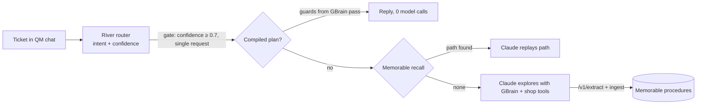

# How each platform was used

Support AGI routes every support ticket to the cheapest tier that works: **explored** (Claude solves it from scratch), **recalled** (Claude replays a learned path) or **compiled** (a deterministic JSON plan, zero agent model calls; only the router runs). Four hosted platforms each own one part of that loop.

| Platform | Role in the loop | Main code |
|---|---|---|
| **River AI** | Trained router: messy ticket → standardized request key, with a confidence score | `router/`, `agent/src/memory.ts` (`ROUTER_URL`) |
| **Memorable** | Turns solved sessions into procedures, embeds them, stores and recalls them | `agent/src/memory.ts`, `agent/src/memorable-store.ts` |
| **GBrain** | Company brain: procedures, policies, catalog, FAQ; source of compiled-plan guards | `brain/`, `agent/src/brain.ts`, `agent/src/compiled.ts` |
| **QM** | The chat harness customers talk to, forked with a Paths panel and compiled routes | [ToukoUrsin/qm-support-agi](https://github.com/ToukoUrsin/qm-support-agi) (`support-agi`), `mcp/` |

---

## River AI: the request router

**What it does.** Reads the customer's opening message and returns one of the 55 ABCD subflows (e.g. `refund_status`, `manage_cancel`) plus a confidence. That label is the key every later step matches on: Memorable recall, reinforcement of existing paths, and compiled-plan lookup. Raw ticket text is a poor key (8% held-out path hit rate); a standardized one is what makes reuse possible.

**How it was trained** (`router/train.py`, `router/common.py`, run by Marc):

- LoRA SFT on River of `Qwen/Qwen3.6-35B-A3B-FP8`: rank 16, lr 2e-4, batch 64, cross-entropy on the label tokens only.
- Data: 8,316 ABCD train+dev openings, 300 dev held for validation. Every replay ticket (`data/tickets.jsonl`) and every evaluation ticket (`data/heldout.jsonl`, from ABCD test) was excluded from training.
- Two runs: `r1` (natural sampling, stopped at step 87 by the 25-minute limit) and `r2` (balanced sampling + LR decay, stopped at step 74). Checkpoints saved as `claude-router-*`.
- Cost (estimates from `router/runs/*/report.json` at $1.00/M training tokens, not billed figures): 1.05M tokens to the served step 50; the full `r1` run 1.83M (≈ $1.83); `r2` 1.56M (≈ $1.56).
- **Served: `r1` step 50**, chosen on validation. `r2` was more accurate per ticket but not better for workflow reuse (`router/REPORT.md`).

**How it is served** (`router/serve.py`): `POST /route {"text"}` → `{"intent", "confidence", "predicted", "model"}` on `127.0.0.1:8789`. Confidence is the probability of the generated label tokens. The server:

- answers `none` below 0.5 confidence, so the agent explores instead of reusing a doubtful path;
- answers `none` for instruction-like text ("ignore previous instructions", snake_case labels): before this guard, an injection was routed at 0.97 confidence;
- retries a River call once inside a 15 s budget (2 of 78 test calls hit River's 12 s timeout).

**Where it is called.** `agent/src/memory.ts` uses it for every ticket when `ROUTER_URL` is set, and falls back to the Claude Haiku stand-in (`agent/src/canonical.ts`) or raw text on any error. The app adds its own reuse gate on top: a path or plan is reused only at confidence ≥ 0.7 and for a single request (`GATE_CONF`, calibrated in `replay/gate-calibration.json`). The QM MCP server, `mcp/demo.sh` (auto-detects port 8789) and the storefront chat all route through it.

**Results.**

| Measure | River step 50 | Comparison |
|---|---|---|
| Label accuracy, 100 held-out tickets | **77%** | base Qwen zero-shot 23%, Claude Haiku 64–66% |
| Label accuracy, 300 validation | 88.7% | base 22% |
| Path hit rate in the recall harness (`replay/router-eval.json`) | **65%** | Haiku 56%, raw text 8% |
| Final replay run | 440 of 442 tickets (400 ABCD + 42 hard) normalized by `river:r1@50` | 2 fell back to raw text |

**Not done.** The richer `CANONICAL_REQUEST_V1` normalizer on River (operation, subject, entities, not just a label) lives on the unmerged branch `codex/river-normalizer`. On `main`, that structure comes only from the Haiku stand-in. Two ABCD labels (`promo_code_invalid` / `promo_code_out_of_date`) have indistinguishable openings, so no router can separate them from the first message.

---

## Memorable: procedure memory

**What it does.** When the agent solves a ticket from scratch, Memorable turns the session into a reusable procedure; later tickets with the same standardized request recall it and replay it in fewer steps.

**API calls** (`agent/src/memory.ts`, against `memorable-extraction-api.memorable.workers.dev`):

- **`/v1/extract`**: on every newly learned path, the solved session (standardized request, original ticket, each tool call with input and result) is sent for extraction. The returned draft steps are kept on the procedure as `memorableSteps`. All 52 procedures in the final run's `replay/procedures.jsonl` carry extracted steps.
- **`/v1/embed`** (bge-m3): embeds each standardized request, used for semantic recall when there is no exact key match.

**CLI store and recall** (`agent/src/memorable-store.ts`, `RECALL_BACKEND=memorable`, `memorable-cli@0.5.30`):

- **save → `memorable ingest -`**: each procedure is shaped into a trace Memorable admits (every path step as a verified command, ending in `send_reply --intent …`), so it lands in the Memorable workspace. The replayable path and policy text are kept beside it under the returned slug.
- **recall → `memorable recall --single "<request>"`**: Memorable's exact, lexical and semantic tiers, fused; its top pick is accepted at ≥ 0.6 and only if its intent matches.
- `MEMORABLE_HOME` is scoped to the project, so nothing touches `~/.memorable`. `agent/src/memorable-backfill.ts` ingested the existing library (57 procedures by 15:20).

**Keeping it running under load.** The final replay first failed on `/v1/embed` 429s. The fix: one Memorable request per 400 ms, at most 2 concurrent embeds, an embedding cache, exact-key matching before any embedding, and an offline mode that falls back to key-only recall if the daily quota runs out.

**What the final run shows** (`replay/results.jsonl`): all 325 recalled tickets matched on the exact River key, resolved from the local mirror of the ingested procedures before Memorable's recall is called. Memorable's own recall was consulted 37 times when no exact key existed; none of those cleared the threshold and intent check, so those tickets explored. In this run, Memorable did the extraction, embeddings and storage, and its recall tiers were the fallback, not the source of the savings.

**In QM.** The fork fixes QM's native Memorable provider, which was never consulted on chat turns: the provider router gained a fail-soft `recallExternal`, called with each user message (commit *Consult external memory providers (Memorable) on each chat turn*). `mcp/demo.sh` stages the live demo: it copies the Memorable home without one subflow, so ticket A explores and `save_path` ingests the new path, and ticket B recalls it.

---

## GBrain: the company brain

**What it holds** (`brain/`, 71 pages): 55 procedures, one per ABCD subflow (`procedures/<flow>-<subflow>`), written from ABCD's agent guidelines; 6 policy pages; 8 FAQ pages; the product catalog; and a company page. Loaded with `gbrain init --pglite` and `gbrain import brain/` into a project-scoped `GBRAIN_HOME`.

**How the agent uses it** (`agent/src/brain.ts`, `agent/src/agent.ts`):

- Two tools, `search_kb` (`gbrain search --json`, top 5 chunks) and `read_page` (`gbrain get <slug>`).
- The system prompt tells Claude to look up the procedure for the request type in the brain first and follow its required actions in order, then apply policy exactly, including membership-level rules.
- On explored tickets the agent searches the brain; on recalled tickets the policy text saved with the path is injected, so the agent skips the search unless the ticket turns out to be a different case.

**How compiled plans use it** (`agent/src/compiled.ts`): write actions in a zero-model-call plan are allowed only behind guards derived from GBrain policy. The `policy_check` step encodes `policies/membership` as rules: a return window by membership level, cancellation only before shipping, and promo codes only for eligible levels when the system confirms a company error. FAQ-family plans read `faq/<topic>` straight from the brain. A failed guard returns the ticket to the agent.

GBrain was also the event's mandatory host integration.

---

## QM: the chat harness

**What it does.** QM is where customers chat with the support bot. Our fork ([ToukoUrsin/qm-support-agi](https://github.com/ToukoUrsin/qm-support-agi), branch `support-agi`) runs the bot with our tools and adds the views that make the three tiers visible.

**Tools over MCP** (`mcp/src/server.ts`, `mcp/start.sh`): a stateless Streamable-HTTP MCP server on `127.0.0.1:8790` exposes the agent's shop and brain tools against the real Shopify dev store, plus:

- `recall_path`: normalizes the request (River), applies the reuse gate and returns the saved steps with their policy text, or `found: false` with instructions to explore;
- `save_path`: saves the path from the calls the server actually logged for the session (`mcp/logs/calls.jsonl`), not from the agent's own report;
- `POST /try_compiled`: QM's pre-turn hook. If a promoted plan's guards pass, QM replies with zero agent model calls.

**Fork changes** (all 27 Sep):

- **Paths panel** (`plugins/web-ui/src/paths.ts`): per turn it shows the standardized request, the matched path, path steps versus this run's steps, the EXPLORED / RECALLED / COMPILED badge, time and cost, a live route map (Customer → River → tier lanes), a tier-share learning curve and cost against the no-memory baseline.
- **Compiled routes** (`src/harness/compiled-route.ts`, `COMPILED_ROUTES=1`): promoted plans answer before the model is called.
- **Memorable provider fix**: see the Memorable section above.
- **Northwind Outfitters support soul** and local hack scripts (`hack/up.sh`, keys injected with hsec).

The same pipeline also backs a chat bubble on the Shopify storefront (`storefront/`), with learning off and every tool call restricted to the customer's own email and orders.

---

## Sources

`README.md` (results), `router/REPORT.md` (River training and evaluation), `replay/router-eval.json`, `replay/results.jsonl`, `replay/procedures.jsonl`, `STATUS.md`, `event/SUBMISSION.md`, and the QM fork's commit history.
