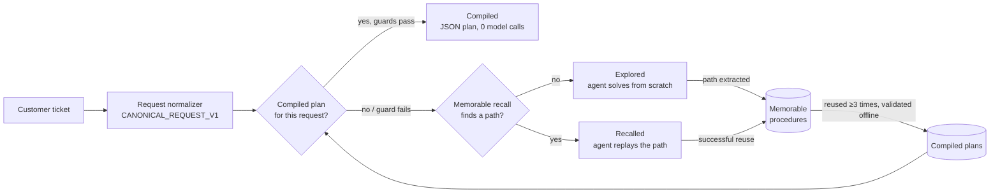

# Support AGI — support that compiles itself

Team **Support AGI**: Touko Ursin, Marc Smeds · Own Your Intelligence Hackathon, YC San Francisco, 27 September 2026.

A customer-support agent that gets cheaper the more tickets it handles. The first time a kind of request arrives, the agent solves it from scratch with company knowledge from GBrain and the shop's tools, and Memorable stores the path it took. The next similar request is standardized into a fixed request structure and recalls that path, so the agent replays it in a few steps. Once a path has been reused successfully enough times, it compiles into a deterministic plan that runs with **zero model calls**. Anything a plan's guards cannot handle falls back to the agent. Not every ticket compiles; the system compiles what it safely can.

## Three tiers



| Tier | What runs | Model calls |
|---|---|---|
| Explored | Claude agent + GBrain + shop tools, no prior path | Full agent loop |
| Recalled | Claude agent follows a procedure recalled from Memorable | Fewer steps |
| Compiled | JSON program: bindings from the canonical request, tool calls, guards from GBrain policy, reply template | None |

Compiled plans are promoted in shadow first: a plan is checked against the agent's own result on real tickets before it is allowed to answer.

## How each host is used

- **GBrain** — the company brain: 71 pages (55 procedures from ABCD agent guidelines, policies, catalog, FAQ). The agent searches it on every explored ticket, and compiled plans take their guards from its policies. `brain/`, `agent/src/brain.ts`.
- **QM** — the harness customers chat in. Our fork ([ToukoUrsin/qm-support-agi](https://github.com/ToukoUrsin/qm-support-agi), to be published) runs the support bot with our tools over MCP (`mcp/`), adds a **Paths panel** (recalled vs explored per turn, steps, time, cost, learning curve) and fixes QM's Memorable provider, which was never consulted on chat turns.
- **Memorable** — procedure extraction (`/v1/extract`), storage and recall (`agent/src/memorable-store.ts`, `RECALL_BACKEND=memorable`). Successful agent traces become procedures; later tickets recall them.
- **River AI** — the request normalizer: messy ticket in, `CANONICAL_REQUEST_V1` out (`CANONICAL_REQUEST_V1.md`), which is what recall and compiled plans match on. Marc is training this model on ABCD with the River API. **Until his endpoint lands, a Claude Haiku stand-in emits the same structure** (`agent/src/canonical.ts`); set `ROUTER_URL` to switch to River.
  - River results: {{RIVER_RESULTS}}

## Data

- **ABCD** (Action-Based Conversations Dataset, ASAPP Research, MIT): human-to-human support conversations for an online clothing retailer, each with the **action sequence the human agent took**. We use 400 tickets for replay and 100 held out for evaluation, and score our agent's tool calls against the human actions. See `DATASET.md`.
- **Shopify dev store** "Northwind Outfitters": 16 products (Unsplash photos, `data/PHOTO_CREDITS.md`) and test orders seeded from the ABCD customers (`data/seed_shopify.ts`). The live QM demo runs against it.
- **Hard tickets** (`data/HARD_TICKETS.md`): 42 tickets from the long tail — 15 real ABCD conversations (longest, changed requests, rarest intents) and 27 constructed edge cases (multiple requests, missing identifiers, contradictions, policy edges, angry customers, must-escalate, non-English, typos). They should stay with the full agent, not a cheap path.

## Results

Replay of 400 ABCD tickets in order, mock shop, 25-ticket buckets.

| Metric | Value |
|---|---|
| Cost per ticket, first bucket → last bucket | {{COST_FIRST}} → {{COST_LAST}} |
| Cost per ticket, no-memory baseline | {{COST_BASELINE}} |
| Share per tier, last bucket (explored / recalled / compiled) | {{TIER_SHARE}} |
| Compiled-plan accuracy (reply agreement with the agent) | {{COMPILED_ACCURACY}} |
| Router hit rate on 100 held-out tickets (raw text vs normalizer) | {{ROUTER_HIT_RATE}} |
| Agreement with the human agent's action sequence | {{HUMAN_AGREEMENT}} |
| Hard tickets: tier they ended in | {{HARD_TICKET_TIERS}} |

Raw outputs: `replay/summary.json`, `replay/summary-baseline.json`, `replay/compiled-eval.json`, `replay/router-eval.json`.

## What's real vs simulated

- **Real:** the Claude agent, GBrain, Memorable API calls, the QM fork, the Shopify dev store and its API calls, ABCD conversations and human action sequences, all measured costs and times.
- **Test data:** the Shopify store is a development store with test orders; no real customers or payments.
- **Mock shop for replay:** the 400-ticket replay uses a local mock of the same shop data (`agent/src/shop.ts`) so it can run fast and repeatably; the live demo uses Shopify.
- **Constructed:** 27 of the 42 hard tickets were written by us and are labeled `source: "constructed"`.
- **Stand-in normalizer:** until River's endpoint is live, the canonical request comes from Claude Haiku, labeled as a stand-in everywhere it appears.
- **Offline validation:** compiled-plan accuracy is judged by Claude Haiku comparing the compiled reply with the agent's reply on the same ticket.

## Built today

All code was written during hacking hours (13:15–17:00 PDT). No prior projects or code were reused. The only fork is QM, which QM's side quest invites.

| Time (PDT) | Commit |
|---|---|
| 13:00–13:40 | Setup and docs: hackathon brief, rules, notes |
| 13:56 | Core idea; first code: support agent on GBrain with shop tools and step traces |
| 14:12–14:27 | Real support data; Memorable layer and replay harness; MCP server for QM; Shopify backend; switch to ABCD |
| 14:31–14:49 | Northwind Outfitters brain, catalog and seeding; QM MCP tools on Shopify; Memorable-backed procedure store |
| 14:54 | Canonical request v1 normalizer (Haiku stand-in for River) |
| 14:56 | Compiled paths: reused procedures become deterministic JSON plans |
| 15:05 | Shadow promotion for compiled plans |
| 15:12 | 42 hard tickets |

Full history: `git log`. QM fork commits: Paths panel, Memorable provider fix, Northwind support soul.

## Run

```bash
# GBrain with the company brain
GBRAIN_HOME=$PWD/.brain-home gbrain init --pglite --no-embedding
GBRAIN_HOME=$PWD/.brain-home gbrain import brain/ --no-embed

# One ticket through the agent
cd agent && bun install
ANTHROPIC_API_KEY=... bun run src/cli.ts "where is my order? jane@example.com"

# Replay the learning curve (mock shop); NORMALIZER=haiku or ROUTER_URL=<River endpoint>
bun ../replay/run.ts --n 400 --bucket 25
bun ../replay/compile_eval.ts     # compile, validate and simulate the three tiers
bun ../replay/eval_router.ts      # router hit rate on held-out tickets

# MCP server for QM (Shopify backend)
../mcp/start.sh
```

Keys: `ANTHROPIC_API_KEY`, `MEMORABLE_API_KEY`, `SHOPIFY_ADMIN_TOKEN`.

## Repository

Our thinking along the way: [Codex and Claude Code conversations](jorney/README.md).

`agent/` support agent, normalizer, memory, compiled plans · `mcp/` tools for QM · `replay/` replay, evals, plans · `brain/` GBrain pages · `data/` ABCD splits, hard tickets, Shopify seeder · `event/` rules and submission · `IDEA.md`, `CANONICAL_REQUEST_V1.md` design.
