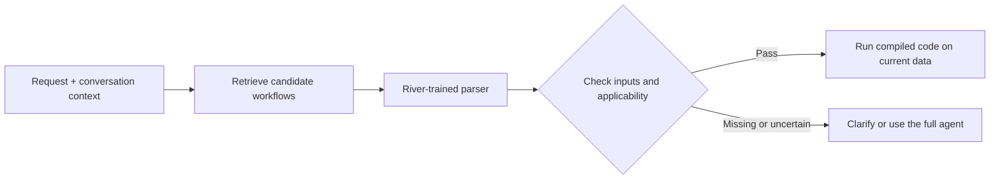
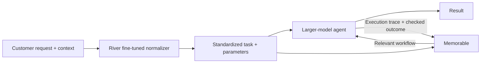

# Codex: from token-cost idea to Support AGI

Exported from a Codex session on 2026-09-27. User and assistant messages only, in original order; tool calls and tool output omitted. Credentials and personal contact details redacted.

## User

I've got this one idea from my own experience: the thing is that tokens are expensive but by analysing usage patterns/history conversation with some specific methods we can automatically identify repeating patterns and turn them into deterministic code and patterns that is easy to run

## Codex

This suggests a product that turns repeated agent work into reusable code. I’ll check where it overlaps with Memorable and what would make the savings measurable in a hackathon demo.

I found close prior art: TraceCompiler and autocompile both describe turning agent traces into executable workflows, and Memorable already extracts and replays procedures. The strongest angle for your product may be finding expensive repetition automatically, generating reusable code, and showing that it saves money on new cases while preserving correctness.

Understood—the feature itself discovers what to automate from historical interactions. Users supply their history, and the product finds recurring patterns and turns suitable ones into executable code. I’ll frame it around that automatic discovery.

Understood. **Automatic discovery is the product:** it examines historical interactions, finds repeated work, and converts suitable patterns into reusable executable code.

The proposition could be:

> **Turn the work your agents have already done into software they can reuse.**

The user supplies history. The system determines what is worth compiling.

| Stage | What the product does |
|---|---|
| **Observe** | Read conversations, tool calls, arguments, results, corrections, and token usage. |
| **Discover** | Find recurring sequences—even across differently worded requests and larger, unrelated tasks. |
| **Generalize** | Separate stable operations from changing inputs such as filenames, dates, identifiers, and filters. |
| **Compile** | Generate parameterized functions or scripts, retaining model calls only where judgment remains necessary. |
| **Validate** | Run the generated code on cases excluded from generation and independently check the outcomes. |
| **Reuse** | Make the code available as callable tools; check applicability and return to the agent when conditions don’t match. |

**The valuable unit can be a repeated fragment within a task.** An entire conversation may be unique while repeatedly containing the same data retrieval, filtering, transformation, validation, or reporting steps.

The specific methods I would investigate are:

- **Sequence mining:** discover frequently repeated tool-call sequences.
- **Semantic clustering:** group requests with similar intent despite different wording.
- **Parameter inference:** identify which values change between executions.
- **Data-flow analysis:** establish which outputs actually feed later steps; chronological order alone does not establish a dependency.
- **Program synthesis and testing:** turn those patterns into code and check whether it generalizes.

Conversation text helps reveal intent. **Tool calls and their results provide much stronger evidence for executable behavior.**

There is close prior art: [TraceCompiler](https://arxiv.org/abs/2608.02680) researches this transformation, [autocompile](https://github.com/mirkokiefer/autocompile) mines traces into executable workflows, and [Memorable](https://www.memorable.sh/) already extracts reusable procedures. We should position our contribution around how effectively it discovers opportunities in existing histories, produces usable code, and demonstrates net savings.

For the main hackathon, the convincing demonstration would be:

1. Import mixed interaction history.
2. Automatically discover recurring work without a predefined target.
3. Show the generated code and inferred inputs.
4. Execute it successfully on new inputs.
5. Compare correctness, tokens, cost, and time against the original agent approach.

**Savings must include the cost of analysis, generation, validation, routing, and fallback.** Otherwise, we could spend more discovering an automation than it ever saves.

I’d rate this **potential value 5/5 for frequent agent users, hackathon effort 4/5**. We can limit the supported history format and operations while preserving automatic discovery as the central feature.

## User

But where do we focus. What wedge for fouc

## Codex

I’ll narrow this to a first customer and entry point, while keeping automatic discovery at the center.

**I’d focus on teams running customer-support agents, and automatically compile their repeated data-gathering work into reusable tools.**

The promise:

> **Connect your agent history. We discover repeated work and turn it into tested code that lowers the cost of each resolved ticket.**

This narrows the customer and the operations we support. **The system still discovers the patterns automatically.**

| Focus | First version |
|---|---|
| **Customer** | Developers operating support agents with metered model costs |
| **Input** | Historical conversations, tool calls, results, and usage |
| **Patterns eligible for compilation** | Repeated API reads, filtering, joins, calculations, and formatting |
| **Output** | Parameterized functions the existing agent can call |
| **Proof of value** | Lower total cost and latency on new cases, with equivalent task outcomes |

For example, the history might reveal that many different requests contain the same sequence: find the customer, retrieve their orders, retrieve delivery events, and assemble the relevant facts. The system discovers that sequence and produces a callable tool. Customer IDs and dates become inputs; each execution retrieves current data.

That is an illustration of a possible discovery—not a workflow we would hardcode.

I would choose this wedge for four reasons:

1. **Repeated structure:** different customer questions can share substantial preparation work.
2. **Checkable results:** we can compare retrieved records and calculated values against expected results.
3. **A clear buyer:** the team operating the agent benefits from lower cost per successful request.
4. **A small adoption step:** add generated tools to an existing agent, keeping its current interface.

My assessment of the alternatives:

| Starting point | Main advantage | Main difficulty |
|---|---|---|
| **Support-agent API histories — recommended** | Repetition and measurable business outcomes | Access to representative traces |
| Coding-agent histories | Accessible to developers; good hackathon audience | More variation in tasks and repository state |
| Browser-agent histories | Visually compelling | Changing interfaces complicate reliable reuse |

There is already overlap with [Memorable](https://www.memorable.sh/) and [autocompile](https://github.com/mirkokiefer/autocompile). Our competitive argument would need to be **automatic discovery plus demonstrated savings in a specific customer’s workload**.

For today’s demo: import mixed histories, discover a repeated sequence, generate code, run it on a new case, and show correctness and net savings—including compilation costs. That proves the central feature without attempting a universal compiler.

## User

A good wedge. So now our novel way, how do we understand the customer support prompts so that we've got a reliable way to process these and produce the correct workflows. Like we probably need  some kind of lmachine learning model to.in a way to learn to embed requests. Or what if we finetune a language model with River AI to rewrite requests into a standardised/learned way and then do ? with the output and compare against already answered

## Codex

We can use a model to map varied support requests into a structured task description, then match that description to a tested workflow. I’ll check how River fine-tuning could help, and where we need explicit checks to avoid choosing the wrong workflow.

I’m using the training-outcome discipline skill here: River fine-tuning should earn its place by improving routing accuracy or cost on unseen tickets. The useful training target is whether different requests can use the same workflow, with the right parameters and conditions—not just whether their wording is similar.

The key distinction is between “these requests sound alike” and “this workflow can handle both correctly.” River could learn to produce a structured intent and parameter binding, while code checks whether the selected workflow applies. We should train from verified request-to-workflow examples and test on unseen tickets, including similar-sounding requests that require different handling.

**Your River idea fits well: train a model to translate varied support requests into structured workflow calls.** Then match those calls to executable workflows discovered from history.

The useful learning target is:

> **Which requests can be handled by the same verified computation, with different input values?**

That requires both understanding the request and understanding how previous cases were actually solved.

**We have two connected learning processes.**

| Process | Learns from | Produces |
|---|---|---|
| **Workflow discovery** | Historical tool calls, their inputs/outputs, and verified outcomes | Reusable code, required inputs, and conditions under which it works |
| **Request interpretation** | Requests paired with the workflows that correctly handled them | A model that selects a workflow, extracts parameters, or recognizes that none applies |

The workflow families emerge from the history. We don’t have to manually invent a fixed list of support categories.

For a new request, I’d use this architecture:



**The standardized output should be a small structured object.**

For illustration, both:

- “Where is order A123, and when will it arrive?”
- “Track A123 and tell me its expected delivery date.”

could produce:

```json
{
  "workflow_id": "delivery_status_v1",
  "arguments": {
    "order_reference": "A123"
  },
  "requested_outputs": [
    "current_status",
    "estimated_arrival"
  ],
  "decision": "candidate"
}
```

That workflow name is illustrative; the actual entry would come from a discovered, tested procedure.

The original request stays available alongside this representation. A rewrite can accidentally lose a negation, condition, or second request.

**Embeddings help find candidates; they don’t establish that execution is correct.**

Consider:

| Request | Required distinction |
|---|---|
| “Has my order been cancelled?” | Read cancellation status |
| “Cancel my order.” | Request a state change |
| “Don’t cancel it—just tell me where it is.” | Read delivery status, preserve the prohibition |
| “Where is it?” | Resolve the reference from conversation context or ask |

These requests may be close in an embedding space while requiring different handling. For our initial read-only wedge, cancellation requests would go to the existing agent.

I would start with an existing embedding model. It retrieves a few compact workflow descriptions. The River model receives those descriptions plus the request and available conversation context, then returns the structured binding. Supplying candidate descriptions also lets us introduce newly discovered workflows without making the model memorize every workflow ID.

**River training would use examples derived from verified history.**

1. **Discover repeated execution patterns.** Follow actual data dependencies between tools, separating changing values from stable operations.
2. **Compile and test candidate workflows.** Establish their input schema, supported cases, and expected outputs.
3. **Associate historical requests with those workflows.** A past answer alone isn’t proof that the workflow was correct.
4. **Build training pairs:** request + preceding context + candidate workflows → correct workflow and arguments, or `clarify` / `unsupported`.
5. **Include difficult negatives.** Similar wording with different required behavior, missing references, negation, and multiple requests.

River supports supervised fine-tuning with LoRA, and its documentation explicitly illustrates training support requests into structured records. That is a suitable first training method here. [River SFT guidance](https://docs.river.ai/guides/sft-concepts/), [LoRA support](https://docs.river.ai/guides/lora/)

If retrieval later proves to be the bottleneck, we could train embeddings using **same-workflow examples as positive pairs** and **similar-sounding but incompatible requests as negative pairs**. I wouldn’t add that training step until we measure the need.

**The “then do what?” is: bind, check, execute, and verify.**

After interpretation, ordinary code checks:

- The selected workflow exists and its version is supported.
- Required arguments are present and grounded in the request or context.
- The authenticated customer can access the referenced records.
- Current data satisfies the workflow’s prerequisites.
- The result meets the workflow’s output checks.

We reuse the **procedure**, while fetching current customer data. An earlier answer might already be outdated.

Those checks reduce failure modes, but valid JSON and passing prerequisites cannot guarantee that the model understood the customer. We need to measure **wrong workflow execution**, alongside how many requests the system can handle automatically. A model’s self-reported confidence is insufficient.

For the hackathon, I’d compare an untuned parser and the River-trained parser on the same untouched tickets. Keep related tickets and paraphrases together when splitting the data. Measure correct workflow **and arguments**, unsupported-request handling, actual task outcomes, latency, and total cost including training and fallback.

Request canonicalization itself is established semantic-parsing research. [Relevant paper](https://arxiv.org/abs/2104.08768) Our proposed contribution would be the complete loop: **discover executable patterns from history, teach a model when they apply, and prove that reuse preserves outcomes while reducing cost.**

## User

Yea we spoke with the guys from river.ai and memorable; We will use them in the harness/feature. Standardise a request structure/language with river.ai finetuned model and then feed the standardised request into a larger model and mark the agent session for memorable to do the pattern matching and produce a results/workflow

## Codex

That sets the initial architecture: River standardizes the request, the larger model runs the agent session, and Memorable captures and matches the workflow. I’ll record that decision and check how to label sessions so the same intent can be recognized across runs.

**That gives us a clear product hypothesis: standardizing requests makes successful agent work easier to recognize and reuse.** River handles standardization; the larger model solves the task; Memorable captures and retrieves the procedure.



**Our key design choice is to separate the task pattern from its changing values.**

For example:

| Part | Example |
|---|---|
| Standardized task | Retrieve order delivery status and estimated arrival |
| Parameters | `order_reference = A123` |
| Constraints | Preserve any conditions or prohibitions in the original request |
| Session context | Customer identity, available tools, schema version |

Different wording should produce the same task structure. Different order numbers should become parameters. Meaningful differences—such as checking cancellation status versus requesting cancellation—must remain distinct.

**The harness would connect the pieces like this:**

1. River produces the standardized request.
2. The harness validates its structure and retains the original request for reference.
3. Memorable receives the standardized task for recall.
4. The larger model receives the task, actual parameters, context, and any recalled procedure.
5. The harness records tool calls, results, and the checked outcome.
6. Memorable extracts or updates the reusable procedure.

For custom harnesses, Memorable’s public extraction example uses `session_id`, `task_description`, `harness`, and `tool_calls`. We can implement the session marking through that trace adapter, with additional metadata kept in our own session record. [Memorable documentation](https://www.memorable.sh/doc)

**The experiment should isolate what our River layer adds:**

| Version | What it tells us |
|---|---|
| Larger model alone | Original cost and correctness |
| Larger model + Memorable, original requests | Benefit from procedural memory |
| River standardization + larger model + Memorable | Additional benefit from our feature |

We compare these on new wording and new parameter values, measuring correct outcomes, workflow reuse, latency, and total cost—including River.

One integration detail remains to prove: Memorable’s public API shows a structured procedure draft. We need to establish whether its output can execute directly or guides the larger model through the steps. That determines how far the first version delivers the original **history → deterministic code** goal.

## User

We will use QM harness for the customer support bot. Also this is our repo: [https://github.com/ToukoUrsin/own-your-intelligence-hack.git](https://github.com/ToukoUrsin/own-your-intelligence-hack.git)

## Codex

I’ll inspect the repo, make QM the customer-support harness in our plan, and identify where the River normalizer and Memorable integration belong.

## User

I split the task with Touko; We will do the River.ai finetuning. I've logged in for you on google browser

## Codex

Understood—our part is the River fine-tuning. I’ll inspect the logged-in Chrome session and the repo’s support-bot examples, then prepare the request-normalization dataset and a baseline evaluation.

## User

First write down what we converged on

## Codex

I’ll write the agreed product, architecture, work split, and success criteria into the repo before starting training.

## User

And push to remote

## Codex

I’ll commit the agreed design and push it to a separate branch in the shared repo, preserving Touko’s work on main.

Written and pushed [IDEA.md](https://github.com/ToukoUrsin/own-your-intelligence-hack/blob/codex/river-normalizer/IDEA.md).

It records the agreed architecture, responsibilities, normalization requirements, demo, evaluation, and unresolved decisions.

Branch: `codex/river-normalizer` · Commit: `8777722`  
Remote content verified. Training has not started.

## User

Setup the river.ai to be ready. Another agent is working on brainstorming the text format. Also we will have to use subagents to produce some text data for the finetuning unfortunately

## Codex

I’ll prepare River access, the training scripts, and baseline evaluation while the other agent settles the text format. I’ll also use subagents to prepare synthetic support examples, with final labels waiting for that format.

River’s official training skill supports the setup we need: chat rendering, LoRA training, checkpoints, and recovery after API failures. I’m also using the evidence-first delivery skill so “ready” means we’ve verified access and the scripts can run. The generated tickets will be marked as synthetic, and I’ll leave the final request format to the other agent.

River shows **$1,025 in credits**, with automatic top-up off. The existing `marc-macbook` key is active, but River only displays its prefix after creation. I’ll continue preparing the local tooling while we resolve the key.

I’ll check `hsec` for the River key and use it without printing the secret.

The key from `hsec` authenticated successfully, and River lists access to the Qwen model used in its SFT example. Its current rates are $1 per million training tokens and $0.33/$0.82 per million input/output tokens. I’ll run a tiny inference and checkpoint round-trip to verify the setup while the task-specific training format is pending.

## User

/Users/marcsmeds/.codex/worktrees/river-normalizer/YC-hackathon-27-sept-2026/CANONICAL_REQUEST_V1.md What do you think?

## Codex

I’ll review it against the River training target and Memorable matching needs, especially whether it preserves the details that change which workflow is correct.

The structure fits our plan, especially separating exact bindings from matching text. I’d fix two gaps before freezing training labels:

- **Requested changes need an explicit field.** `request + subscription` cannot distinguish pause, skip, and cancel. A field such as `requested_change` would preserve that distinction.
- **Standalone prohibitions need a place to live.** “Do not cancel my order” has no positive task, but prohibitions currently exist only inside tasks.

The field registry and phrase table at line 63 also need concrete definitions before annotation starts. Those determine whether examples normalize consistently. I’ll keep the River tooling format-neutral while these details are settled.

## User

Go ahead. Get the data with the subagents and setup river.ai and lets get the rocketship to space! Hyp!

## Codex

The subagents have produced **144 synthetic cases**: 96 training candidates, 24 validation cases, and 24 test cases. River authentication and basic inference are working. I’m finishing the checkpoint round-trip and packaging the scripts so we can use the finalized format as soon as it’s ready.

The 144 synthetic cases are ready. I’m checking River’s training and checkpoint round-trip, then I’ll push the setup with clear instructions for applying the finalized request format.

River passed the real round-trip: one training update, a saved checkpoint, and inference from that checkpoint in a fresh session. All 11 local checks passed too. This proves the training connection works; the support normalizer still needs labeled targets in the agreed format.

The format agent has now committed v1. I’m using it to turn the source cases into training targets. Requests the format cannot yet express—such as a precise subscription pause—will retain their original wording for fallback, rather than receive an inaccurate label.

Labeling is underway, with exact order IDs, negation, conditions, and troubleshooting history checked against each conversation. The main format gaps are subscription changes and some replacement/refund preferences. I’m keeping those visible as fallbacks and preparing a matched base-model versus fine-tuned evaluation.

## User

The demo will be a clothing shop in shopify so we could overfit on that kinds of data/requests

## Codex

Yes—let’s specialize it for the Shopify clothing demo: sizing, exchanges, returns, delivery, and order changes. I’m switching the synthetic data now, while keeping unseen paraphrases and order details for evaluation so we can tell whether it learned the requests rather than memorized them.

I’ll use general clothing-store data. One useful format change is to separate what the customer has from what they want—for example, “received size M” versus “exchange for size L”—while keeping availability conditions separate from both.

## User

Touko uploaded some kind of ticket dataset to the github remote

## Codex

I’ll inspect Touko’s dataset and use it as the main source where it fits. The synthetic cases can then fill gaps such as conditional exchanges, size changes, and ambiguous requests.

## User

But also keep in mind to have abundant amount of training data produced with like Luna class model, right?

## Codex

Yes—Luna for bulk generation, with a stronger model reviewing the seed examples and difficult cases. I’ll aim for a few thousand clothing-support examples, combining Touko’s dataset with targeted synthetic coverage. We’ll keep paraphrase families together when splitting the data, so near-duplicates don’t inflate evaluation scores.

Touko uploaded ABCD: 10,042 research conversations with 55 support categories. It’s a useful clothing-retail source, and I’ve synchronized it locally. I’m excluding the demo replay and held-out conversations from training. Some category labels rely on details absent from the opening message, so the normalizer must not invent those details.

The first Luna batch passed schema checks but failed semantic review: some labels turned questions into facts or refund-status queries into refund actions. I’m rejecting those targets and rebuilding them as paired requests and labels. Volume is useful only if the labels preserve the customer’s meaning.

I’m applying the root-cause repair skill to the data generator: each request and target will come from the same explicit scenario, then receive semantic review. That addresses the labeling errors before they can enter training.

## User

Status?

## Codex

- **River works:** authentication, a training update, checkpoint saving, and fresh-session reload all passed.
- **ABCD imported:** 7,606 training openings remain after exclusions; the 400 demo tickets and held-out data stay out.
- **2,000 clothing examples generated with Luna:** I repaired labeling errors and am finishing review of the seed and ABCD labels.
- **48 independent evaluation cases are ready.**

The actual clothing fine-tune has **not started yet**. Next is the final data audit, then a bounded training run and comparison against the base model.

The reviewed corpus is taking shape: 2,000 composed examples plus the seed and ABCD cases. Review corrected 80 of the 96 initial ABCD labels, which confirms why that check mattered. The planned 24-step pilot is estimated at about **$1.10 including one restart allowance**, with a $3 admission limit.

The first experiment is running now. The prepared corpus has **2,192 training examples**, with **24 validation and 24 test cases kept separate**. River is measuring the base model first, then will train for 24 steps and evaluate the saved checkpoint on the same validation cases.

The setup and reviewed dataset are now [pushed to GitHub](https://github.com/ToukoUrsin/own-your-intelligence-hack/tree/codex/river-normalizer/river) in `7840dad`. That includes the training scripts and a local `/route` adapter for Touko’s harness. The base-model evaluation is still running before the training steps.

The base model produced no valid outputs under the frozen schema on the 24 validation cases. Training is now underway. The checkpoint evaluation will show whether it has learned the format while preserving the requests; falling training loss alone won’t establish that.

## User

I'm hedging a bit and also putting Opus 5.5 to work on the model also, but I will tell it to not interfere without. Don't mind.

## Codex

Sounds good. I’ll continue this run on `codex/river-normalizer`, with its checkpoints and evaluation results recorded separately so we can compare approaches afterward.

The run has reached 18 of 24 updates and saved checkpoints along the way. Next is evaluation from the final saved weights. The published data and this experiment remain separate from the Opus work.

The 24-step fine-tune has finished and its checkpoint is saved. River is now evaluating those saved weights. I’m also checking the local `/route` endpoint with a conditional cancellation request to verify that the condition survives the handoff.

The checkpoint improved schema validity from **0/24 to 17/24**, and both simple API probes preserved the requested condition or prohibition. But it still scored **0/24 exact canonical matches** on the harder set.

I also found a concrete error: it copied “I lose” into an order-ID field. I’m tightening that validation and recording this checkpoint as experimental, not ready for automatic reuse.

The API check passed: conditional cancellation retained its guard, the status query retained “do not cancel,” and the malformed order-ID phrase now triggers fallback.

I’m publishing the checkpoint and full comparison. It remains experimental: **16/24 outputs pass the tightened validator, with 0/24 exact target matches**. The report records the remaining errors for the next iteration and comparison with Opus.

Our separate run is [pushed to GitHub](https://github.com/ToukoUrsin/own-your-intelligence-hack/tree/codex/river-normalizer/river).

- **2,192 training examples**, including 2,000 Luna-assisted compositions.
- **24 validation + 24 test cases** kept separate.
- River trained and saved a **24-step checkpoint**; conditional API checks passed.

The model remains **experimental**: schema validity improved from **0/24 to 16/24**, but exact target matches remain **0/24**. It is not ready for automatic reuse.

[Results and checkpoint details](https://github.com/ToukoUrsin/own-your-intelligence-hack/blob/codex/river-normalizer/river/evidence/clothing-pilot/RESULTS.md) are ready for comparison with Opus.

## User

Do you think you're done???

## Codex

No. I stopped too early. The setup and first experiment are finished, but the normalizer has not met the quality bar. I’ll continue from that checkpoint: investigate the failed interpretations, fix the training coverage and target conventions, and run another bounded comparison. I’ll keep this separate from the Opus work.

I also retired the task ledger too early. Its active lookup now fails, so I’m creating a linked continuation record and keeping the remaining model-quality work open.

## User

Also I added memorable API key to hsec

Also anthropic key is also in hsec

## Codex

That helps. I’ll use Memorable to test capture and recall, and Anthropic to check whether normalized requests preserve the customer’s meaning. That will let me assess the handoff beyond JSON matching.

## User

Push a state of training report to remote

Memorable is failing, but the guys are on it to get it up and running for us again

## Codex

I’ll push a fresh training-state report now, including the failed acceptance results and the next iteration’s work. I’ll treat Memorable as an external outage and continue the River and Anthropic work without more Memorable retries.

[TRAINING_STATE.md is pushed](https://github.com/ToukoUrsin/own-your-intelligence-hack/blob/codex/river-normalizer/river/TRAINING_STATE.md) in commit `d3ffc76`; I verified the remote copy. It records the checkpoint, failed quality results, current work, and Memorable outage. I’m continuing the model work.

I’ll treat Memorable as blocked until the team restores it. I’m continuing the River quality work and checking that the harness preserves the full normalized request, including conditions and restrictions.

The audit found a clear problem in the first checkpoint: it learned the JSON shape, but dropped important clauses and never marked unsupported requests for fallback. The corrective batch will emphasize those distinctions—especially questions versus actions, conditions versus facts, and which item a request applies to.

## User

The memorable situation should be resolved. And btw Opus 5.5 got its first versions done.

## Codex

I’ll recheck Memorable now and inspect Opus’s results before starting another River run. We should compare the existing versions on the same requests and use whichever preserves them most reliably.

Memorable is responding through the actual Bun client: HTTP 200 with a 1,024-value embedding. The Python probe still hit Cloudflare, so that probe was misleading about service availability.

Opus’s report shows 77/100 held-out routing matches at step 50, up from 23/100 for the base model. That model selects workflow labels; I’ll keep its results separate from our tests of whether the full request and its restrictions survive normalization.

The new data batch is ready: 96 contrast cases, with an independent review checking the labels before training. I also found a harness bug: it could discard River’s requested sizes, quantities, and conditions when passing the record through the stand-in model’s narrower schema. I’m fixing that handoff and checking fallback behavior.

The review caught and corrected four material label errors, including confusion between the item ordered and the item received. The corrective set now combines those 96 reviewed cases with 192 reviewed seed examples. I also checked for overlap with the replay, held-out, and new hard-ticket sets; none was found by conversation ID or exact normalized text.

Memorable extraction returns a draft, but its admission check rejected the custom support-tool trace as having no recognized postcondition. That integration detail still needs resolving.

The corrective run is now running. It will compare the existing checkpoint with the new weights on the same 24 validation requests, using the same prompt. Its estimated cost bound is $3.33. The data and runner checks passed, and the separate test set stays closed until validation meets the acceptance criteria.

The comparison caught a prompt-format regression before the corrective run produced a checkpoint: the worked examples led the model to wrap its answer in an extra JSON object. I stopped the run and am fixing the example format, then checking a small sample before restarting.

The updated [training report](https://github.com/ToukoUrsin/own-your-intelligence-hack/blob/codex/river-normalizer/river/TRAINING_STATE.md), reviewed data, and harness fixes are pushed in `a5df059`. The restarted run has completed its first update. Opus’s step-50 endpoint also passed two live calls through the harness adapter.

Nine updates are complete. The source review also found two baseline requests that were correct despite differing from the reference JSON, so I’m reporting semantic correctness separately from exact matching. The harness now also rejects compiled plans that cannot provide a requested output.

The first continuation checkpoint is saved at step 33, confirming that training resumed from step 24 correctly. The run is continuing; its final saved checkpoint still needs the source-level quality review before use in the demo.

Thirteen updates are complete. The baseline source review is now on remote alongside the strict metrics: 2/7 supported requests preserved correctly, with seven unsupported requests incorrectly accepted. Those are the comparison numbers for the new checkpoint.

The run is nearing one full pass through the corrective data. I’ll evaluate that saved checkpoint against the same acceptance criteria to see whether the training is addressing the semantic errors before spending the rest of the run budget.

The first-pass checkpoint still fails acceptance: it incorrectly normalizes 10 of the 17 requests that need fallback. I’m reviewing those failures against the training labels while the bounded run continues. This checkpoint is not ready for the demo.

Training has reached 30 updates, with a saved checkpoint at step 51. The first-pass check has not established a quality improvement. I’m keeping the run bounded and checking the labels behind the recurring errors.

The source review confirms a regression after one pass: correct supported requests fell from 2/7 to 1/7. The failures include treating unknown properties as false and adding unstated quantities. I’m stopping after the next saved checkpoint so I can fix the underlying data issues before further training.

The final checkpoint improved to 4/7 fully preserved supported requests, but nine accepted outputs still contain material errors. The remaining failure is at the acceptance step: valid JSON is being treated as faithful meaning. I’m checking a source-based verification gate using the larger-model stage we agreed on.

The first verifier reduced nine bad accepted outputs to two, while retaining all four correct ones. It still fails the zero-error bar. I’m testing a stronger verifier before wiring this into the running endpoint.

The stronger verifier passed the 24-case validation check: it accepted the four fully correct requests and sent every other case to fallback. That result applies to River plus verification; the River model alone still fails. I’m checking the live endpoint’s behavior and timing next.

## User

We're stopping training now. We need to choose between the results on which are we going with.

## Codex

I’ll stop training work and compare the existing results. The latest check shows our guarded canonical model normalized none of the four supported held-out cases, so it isn’t the demo choice. I’m checking Opus’s latest checkpoint and endpoint before making the recommendation.

Go with Opus’s **r1, step 50**. It has the better measured workflow result: **67% correct recall and 15% wrong recall**, versus r2’s 66% and 16%. Our canonical pipeline fell back on all 24 held-out requests, so it adds no useful normalization coverage.

I’m recording that choice and stopping our experimental endpoint. No further training.

